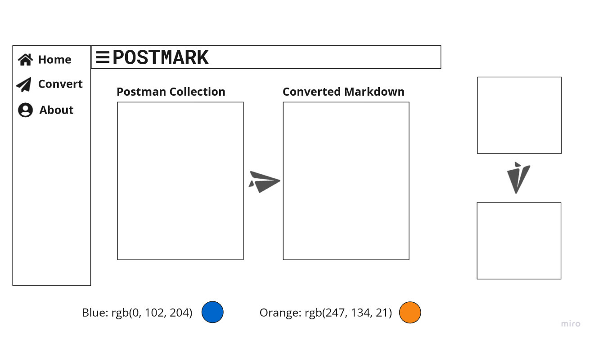

# PostmarkUI
A React/Redux Material-UI Themed Frontend for Postmark

## Project: 

A small Node.js program to convert Postman collections to Markdown friendly syntax. PostMark takes a collection of API routes from Postman and converts it into Markdown friendly syntax ready to be added to a GitHub README.md file. For our first stage we are using GitHub Flavored Markdown, hopefully adding others if time permits.
Since documentation is incredibly important when hosting a project on GitHub we believe that this will help developers very easily show the routes used in their APIs. This should save the developer time, make using a project easier for users and improve readability of documentation.
We hope to make PostMark an installable NodeJS package and eventually a serverless function that any user can pass a JSON-based Postman collection to and receive back Markdown syntax.

### Sandbox: 
Creating a UI for the PostMark npm, bringing in the functionality of this node package where a user can simply input a Postman collection, click a button to render the formatted data to append to or generate docs.

### Team LastPicked for Soccer

### **Authors:** 
>-Jeremy Penning  
>-Matt Ravenmoore  
>-Sowmya Billakanti  
>-Andre Olivier Martin  

### Links and Resources

- `https://pokeapi.co/api/v2/pokemon` - used as a PostMark example
- `https://material-ui.com/` 
- `https://github.com/reduxjs/redux-thunk` - middleware
- `https://www.npmjs.com/package/redux-thunk`

### Setup

> `npm i` - adds the necessary dependencies.

#### How to initialize/run your application (where applicable)

- `npm start`

#### How to use your library (where applicable)

#### Tests

- How do you run tests?
- Any tests of note?
- Describe any tests that you did not complete, skipped, etc

#### Wireframe

